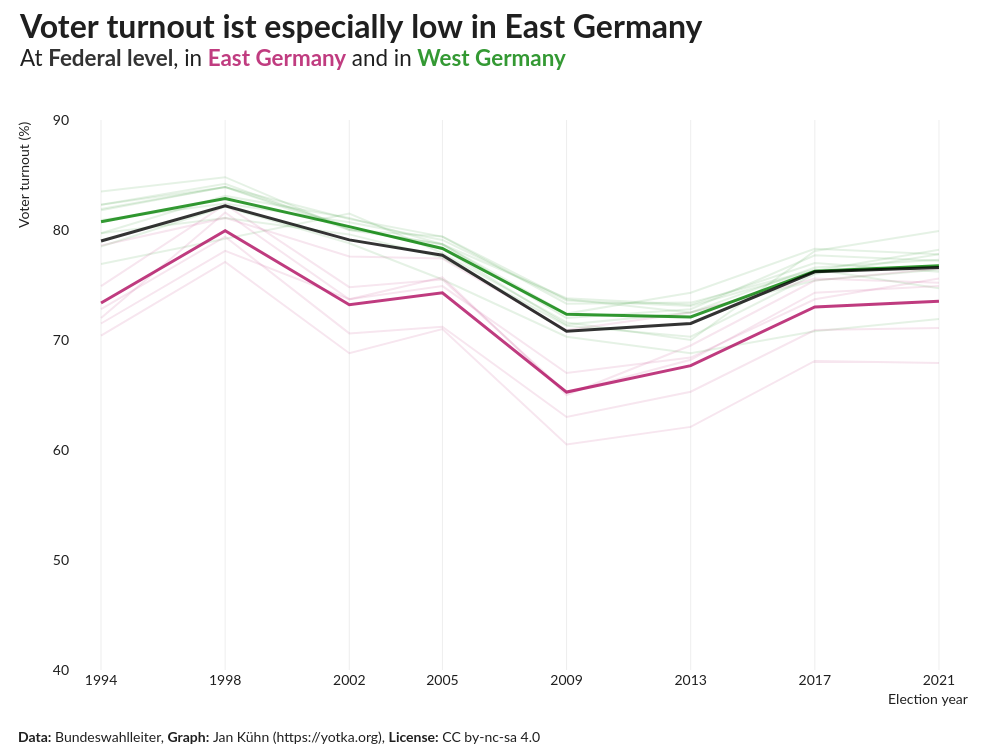
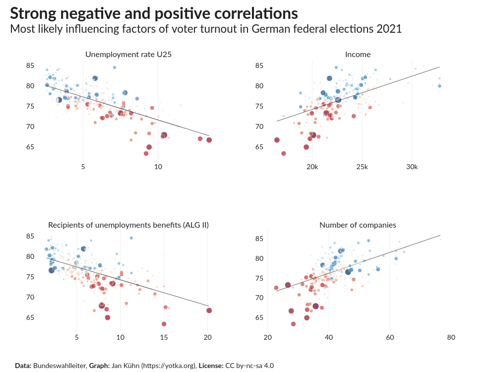
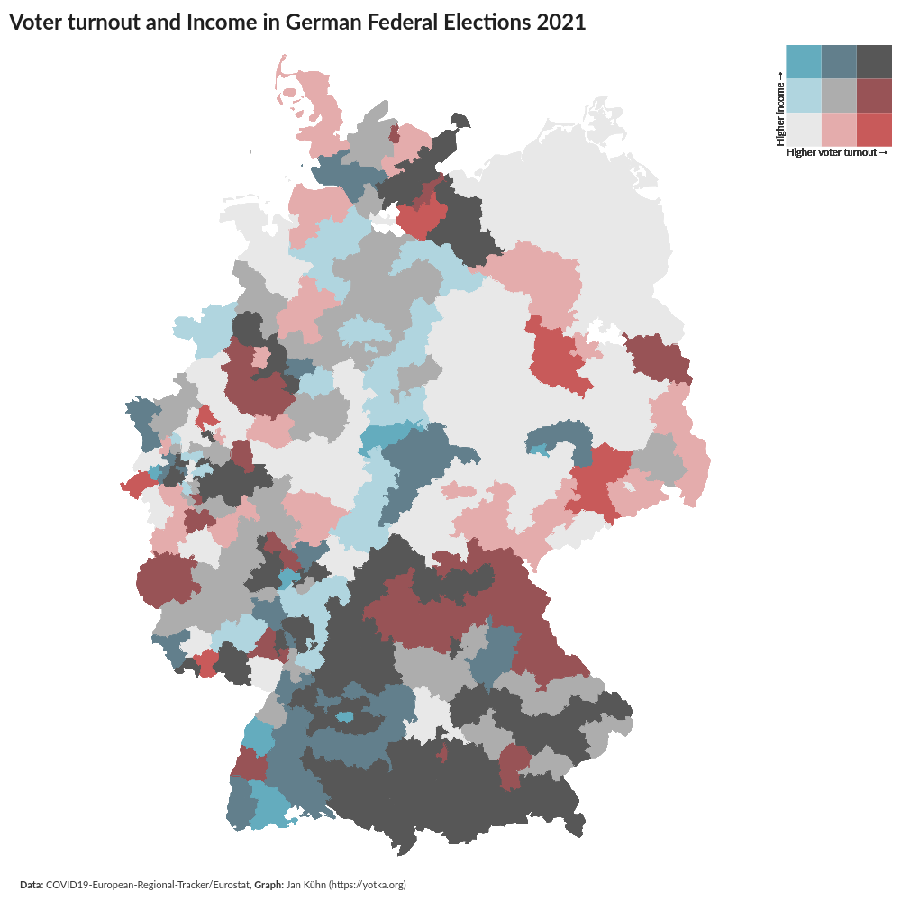

# Causes for declining voter turnouts in German federal elections
_A data visualisation project by [Jan Kühn](https://yotka.org), Oktober 2022_

## What is this about?

For decades, Germany had very high voter turnouts of up to 91% (1972) in its federal elections (Bundestagswahlen). But since 1987 and with some ups and downs, numbers have declined significantly to around 77% in the latest elections in 2021. In elections in federal states (Bundesländer) and on the local level (Kommunalwahlen) these numbers have been even far lower at times.

There is a lot of data available to search for possible causes of the decline in voter turnout. This project tries to find and visualize a small part of them.

The main data source is the ["Bundeswahlleiter"](https://www.bundeswahlleiter.de/), the federal authority regarding elections in Germany. It publishes detailed election results by constituency (Wahlkreis) and also socio-economic data for all constituencies.

## Plots

  
  
  
  

  
  
  
  

## License

This work is licensed under a
[GNU General Public License v3.0](https://www.gnu.org/licenses/gpl-3.0).
